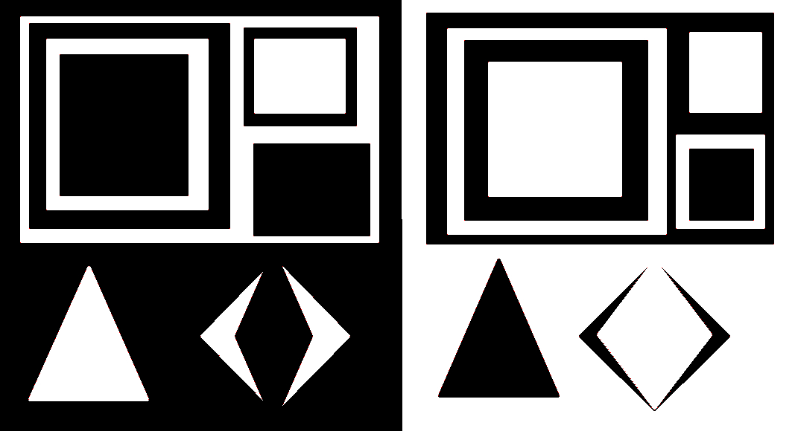
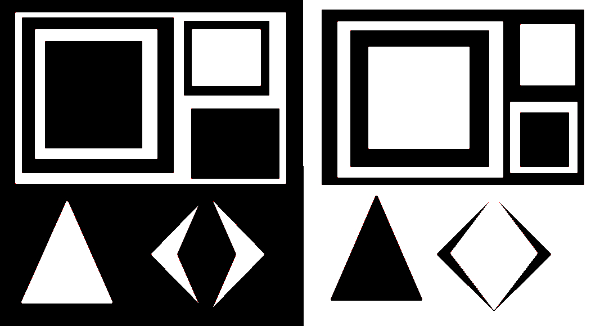
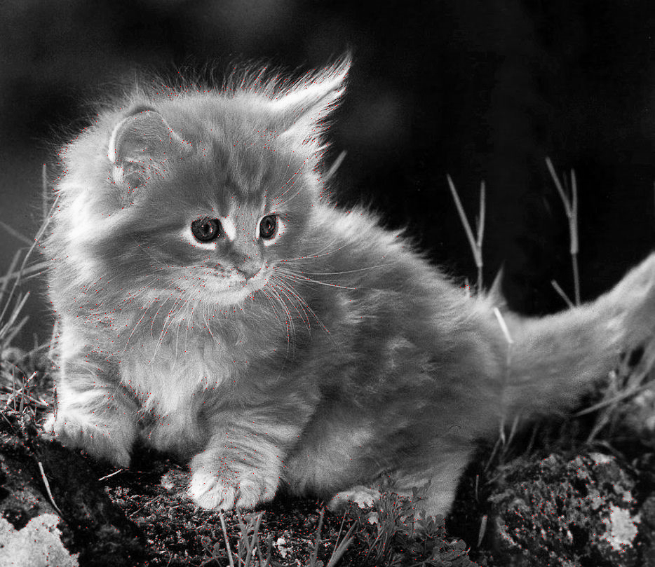

# Лабораторная работа "Harris Corner Detection"

### Детектор углов Харриса

**Задача:** реализовать детектор углов Харриса для выделения особых точек на изображении с использованием CPU и GPU (CUDA).  
**Язык:** C++  
**Входные данные:** grayscale изображение (PNG/JPG) + пороговое значение  
**Выходные данные:** изображение с отмеченными углами (красный цвет) + время выполнения + метрики качества (RMSE, совпадение углов) + ускорение.  
**Особенность:** CUDA реализация должна использовать texture memory.

## Описание работы

Реализован алгоритм детектора углов Харриса на языке C++ с использованием CPU и GPU (CUDA). Для работы с изображениями использована библиотека stb_image.

## Платформа и оборудование

- **Графический процессор (GPU):** NVIDIA GeForce 940MX (Compute Capability 5.0)
- **CUDA версия:** 11.8
- **Процессор (CPU):** Intel(R) Core(TM) i3-6006U @ 2.00GHz
- **Оперативная память:** 8 ГБ
- **Среда разработки:** Visual Studio 2022

## Реализация

### Алгоритм Харриса

1. Вычисление производных Ix и Iy с использованием разностной схемы
2. Вычисление компонент матрицы: Ixx = Ix², Ixy = Ix·Iy, Iyy = Iy²
3. Гауссово размытие компонент (σ = 1.0)
4. Вычисление Harris отклика: R = det(A) - α·trace²(A), где α = 0.04
5. Пороговая обработка и подавление немаксимумов (окно 3×3)
6. Выделение углов красным цветом на исходном изображении

### Реализация на CPU

Функция `harrisCPU` реализует последовательную версию алгоритма. Все этапы выполняются на CPU с использованием циклов. Сложность алгоритма: O(H × W × radius²).

### Реализация на GPU с texture memory

Функция `harrisGPU` представляет собой CUDA-реализацию. Особенности:

- **Texture memory:** входные данные привязаны к текстуре (`texInput`), доступ через `tex2D`
- **Распараллеливание:** сетка блоков 16×16 нитей, каждый поток обрабатывает один пиксель
- **Выделение памяти с pitch:** `cudaMallocPitch` для корректного выравнивания данных
- **Обработка границ:** дублирование крайних пикселей (обеспечивается текстурой)

### Метрики качества

- **RMSE** (Root Mean Square Error) между масками углов CPU и GPU
- **Количество обнаруженных углов** на CPU и GPU
- **Количество совпадающих углов**
- **Процент совпадения** углов

## Результаты экспериментов

### Тест 1: изображение 1067×580, порог 10000

| Параметр | CPU | GPU |
|----------|-----|-----|
| Время выполнения | 604 ms | 522 ms |
| Обнаружено углов | 403 | 402 |
| Ускорение | - | 1.16x |

**Качество:**
- RMSE (CPU vs GPU): 0.7248
- Совпадающих углов: 400
- Процент совпадения: 99.26%

### Тест 2: изображение 934×809, порог 50000

| Параметр | CPU | GPU |
|----------|-----|-----|
| Время выполнения | 1045 ms | 558 ms |
| Обнаружено углов | 2685 | 2685 |
| Ускорение | - | 1.87x |

**Качество:**
- RMSE (CPU vs GPU): 0
- Совпадающих углов: 2685
- Процент совпадения: 100%

### Пример вывода консоли

```
Image: 934x809 Threshold: 50000

--- CPU Processing ---
CPU time: 1045 ms

--- GPU Processing ---
GPU time: 558 ms

--- Accuracy Comparison ---
RMSE (CPU vs GPU): 0
CPU corners detected: 2685
GPU corners detected: 2685
Matching corners: 2685
Corner match rate: 100%

--- Speedup ---
Speedup (CPU/GPU): 1.87276x

Saved: cpu_out_2.jpg and gpu_out_2.jpg
Corners are highlighted in RED
```


## Визуальные результаты

| Тест | CPU результат | GPU результат |
|------|---------------|----------------|
| input_1.png (1067×580) |  |  |
| input_2.png (934×809) |  |  |

## Анализ результатов

### Время выполнения
- GPU время меньше CPU времени для обоих тестов
- Ускорение растет с увеличением размера изображения (1.16x → 1.87x)
- Texture memory обеспечивает эффективный кэшированный доступ к пикселям

### Качество детектирования
- Для изображения 934×809 достигнуто полное совпадение результатов (RMSE = 0, 100% совпадение углов)
- Для изображения 1067×580 совпадение составляет 99.26% (разница в 1 угле)
- Небольшие расхождения обусловлены различиями в обработке границ и порядке операций с плавающей точкой

### Причины ускорения
- Алгоритм хорошо параллелится (каждый пиксель обрабатывается независимо)
- Texture memory оптимизирует доступ к данным при многократном чтении соседних пикселей (гауссово размытие требует доступа к окрестности 7×7)
- Отсутствие гонок данных и атомарных операций

## Файлы репозитория
- `harris.cu` - исходный код реализации
- `input_1.png` - тестовое изображение 1
- `input_2.png` - тестовое изображение 2
- `cpu_out_1.jpg` - результат CPU для теста 1
- `gpu_out_1.jpg` - результат GPU для теста 1
- `cpu_out_2.jpg` - результат CPU для теста 2
- `gpu_out_2.jpg` - результат GPU для теста 2
- `CMakeLists.txt` - файл сборки проекта
